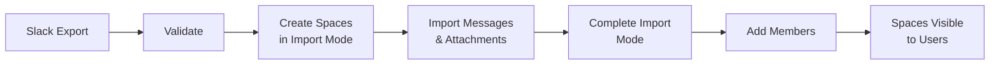
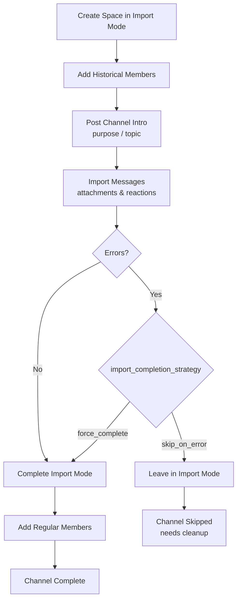

## Slack to Google Chat Migration Tool

Migrates Slack workspace JSON exports into Google Chat spaces via the [Google Chat Import API](https://developers.google.com/workspace/chat/import-data-overview).

### Features

- Imports all messages (including threaded replies)
- Uploads attachments into Google Drive with name+MD5 deduplication
- Migrates emoji reactions using per-user impersonation
- Posts channel metadata (purpose/topic) from `channels.json`
- Retries API calls on transient errors with exponential backoff
- Logs in structured JSON for easy Cloud Logging ingestion
- Filters channels via `config.yaml`
- Automatically generates user mapping from users.json
- Maps external emails to internal workspace emails
- Includes comprehensive reports for both validation runs and actual migrations
- Identifies users without email addresses for mapping
- Automatic permission checking before migration
- Checkpoint-based resumption for interrupted migrations

### How It Works

This tool uses the [Google Chat Import API](https://developers.google.com/workspace/chat/import-data-overview) to migrate Slack data into Google Chat. Important things to know about import mode:

- **Spaces are created in import mode** — they are hidden from users until import is completed
- **90-day deadline** — Google automatically deletes spaces that remain in import mode for more than 90 days
- **No notifications** — messages imported in import mode don't trigger notifications for users
- **No link previews** — URLs in imported messages won't generate link previews
- **Drive-preferred attachments** — file attachments are uploaded to a shared Google Drive and linked in messages (Google recommends Drive for imported content)
- **Archival limitations** — Google Chat's space archive/read-only features are not available during import mode; spaces become fully active once import completes



### Prerequisites

- Python 3.9+ (with `venv` module for virtual environment management)
- Google Cloud SDK (`gcloud`) (optional, only needed for `setup_permissions.sh` script)
  - Not required if using `slack-chat-migrator setup` (recommended) or manual console setup
  - If installing:
    - macOS: `brew install --cask google-cloud-sdk`
    - Linux/Windows: [Official installation guide](https://cloud.google.com/sdk/docs/install)
    - After installation: Run `gcloud init` to configure
- GCP project with Chat & Drive APIs enabled
- Service account w/ domain-wide delegation and scopes:
  - https://www.googleapis.com/auth/chat.import
  - https://www.googleapis.com/auth/chat.spaces
  - https://www.googleapis.com/auth/chat.messages
  - https://www.googleapis.com/auth/chat.spaces.readonly
  - https://www.googleapis.com/auth/chat.memberships.readonly
  - https://www.googleapis.com/auth/drive (for file uploads and shared drive creation)
- Slack export folder:
  ```
  export_root/
    channels.json
    users.json
    <channel_name>/
      YYYY-MM-DD.json
  ```

> **Note:** Using a Python virtual environment is recommended for Python dependency management.
> The Google Cloud SDK is a system-level component that cannot be installed via pip.

### Installation

```bash
# Clone the repository
git clone https://github.com/nicklamont/slack-chat-migrator.git
cd slack-chat-migrator

# Create and activate a virtual environment (recommended)
python -m venv venv
source venv/bin/activate  # On Windows: venv\Scripts\activate

# Install the Python package in development mode
pip install -e .

# Or install directly from repository (still recommended to use a virtual environment)
pip install git+https://github.com/nicklamont/slack-chat-migrator.git
```

> Note: Build configuration is defined in `pyproject.toml`. Install the package with `pip install -e .` rather than running any build files directly.

### Quick Start

```bash
# 1. Set up GCP permissions (one-time, interactive wizard)
pip install slack-chat-migrator[setup]
slack-chat-migrator setup
# Then complete domain-wide delegation in Google Workspace Admin Console

# 2. Generate config from your export (interactive)
slack-chat-migrator init --export_path ./slack_export

# 3. Validate (dry run — no credentials needed)
slack-chat-migrator validate \
  --export_path ./slack_export

# 4. Migrate (credentials required for live migration)
slack-chat-migrator migrate \
  --creds_path /path/to/key.json \
  --export_path ./slack_export \
  --workspace_admin admin@company.com
```

### Configuration

Create a `config.yaml` file (or copy from `config.yaml.example`):

```yaml
# Shared Drive configuration for storing attachments
# Using a shared drive is recommended for organization-wide access
shared_drive:
  # Option 1: Specify an existing shared drive by ID
  # id: "0AInA6b6Ej1Q2Uk9PVA"  # Replace with your shared drive ID

  # Option 2: Specify a shared drive by name (will be created if it doesn't exist)
  name: "Imported Slack Attachments"

  # If neither id nor name is specified, a new shared drive will be created
  # with the name "Imported Slack Attachments"

# Optional: Channels to exclude from migration (by name)
exclude_channels:
  - "random"
  - "shitposting"

# Optional: Channels to include in migration (if specified, only these will be processed)
include_channels: []

# Optional: Override email domains for user mapping
# If not specified, emails from users.json will be used directly
email_domain_override: ""  # e.g. "company.com"

# Optional: User mapping overrides
# Use this to manually map specific Slack user IDs to Google Workspace emails
# This takes precedence over the automatic mapping from users.json
# You can also use this to map external emails to internal ones
user_mapping_overrides:
  # Map Slack user IDs to emails
  "U12345678": "user@example.com"
  # Map bot accounts that don't have emails
  "U87654321": "slackbot@company.com"

# User handling options
# Whether to skip importing bot messages and reactions
# When true, all bot messages and reactions will be excluded from migration
# When false (default), bot messages will be migrated if user mappings exist
ignore_bots: false

# Error handling configuration
# Whether to abort the entire migration if errors are encountered in a channel
abort_on_error: false

# Maximum percentage of message failures allowed per channel before skipping
# If more than this percentage of messages fail in a channel, the channel will be skipped
max_failure_percentage: 10

# Strategy for completing import mode when errors occur
# Options:
#   - "skip_on_error" (default): Skip completing import mode if channel had errors
#   - "force_complete": Complete import mode even if errors occurred
import_completion_strategy: "skip_on_error"

# Whether to delete spaces that had errors during migration
# If true, spaces with errors will be deleted during cleanup
cleanup_on_error: false

# Maximum number of retries for API calls
max_retries: 3

# Delay between retries (in seconds)
retry_delay: 2
```

#### Space Mapping

When using `--resume` to resume a migration, the tool discovers existing spaces by name. If multiple Google Chat spaces have the same name (e.g., multiple "Slack #general" spaces from previous attempts), you need to specify which space to use for each channel:

```yaml
space_mapping:
  "general": "AAAAAgcE123"  # Use this space ID for the general channel
  "random": "AAAABbTr456"   # Use this space ID for the random channel
```

When duplicate spaces are found, the tool will:
1. Skip those specific channels (not abort the entire migration)
2. Mark these channels as failed in the migration report
3. Log detailed information about each space to help you choose
4. Provide exact configuration entries to copy into your config file

> **Note:** Debug and logging options are controlled via command-line flags (`--verbose` and `--debug_api`) rather than configuration file settings. This ensures consistent logging behavior across all migration runs.

### Command-Line Reference

The `slack-chat-migrator` command provides six subcommands:

```
slack-chat-migrator setup             # Interactive GCP setup wizard (one-time)
slack-chat-migrator init              # Generate config.yaml from your Slack export
slack-chat-migrator validate          # Dry-run validation of export data
slack-chat-migrator migrate           # Run the full migration
slack-chat-migrator check-permissions # Validate API permissions (deprecated — use validate)
slack-chat-migrator cleanup           # Complete import mode (deprecated — use migrate --complete)
```

> **Backwards compatibility:** Running `slack-chat-migrator --creds_path ...` (flags without a subcommand) automatically routes to `migrate`, but this implicit routing is deprecated. Use `slack-chat-migrator migrate ...` instead.

#### Subcommands

##### `setup`

Interactive wizard that guides you through GCP project setup: creating a project, enabling APIs, creating a service account, downloading credentials, and testing domain-wide delegation. Progress is saved between runs so you can resume if interrupted.

Requires the optional `setup` dependencies:

```bash
pip install slack-chat-migrator[setup]
```

##### `init`

Generate a `config.yaml` file interactively by analysing your Slack export. Walks through channel selection, user mapping overrides, and error handling preferences.

| Option | Required | Description |
|--------|----------|-------------|
| `--export_path` | Yes | Path to the Slack export directory |
| `--output` | No | Output path for generated config file (default: config.yaml) |

##### `validate`

Dry-run validation of export data, user mappings, and channels. Equivalent to `migrate --dry_run` but expressed as an explicit command. Credentials are optional — you can run a full validation with only `--export_path`. When `--creds_path` is provided, permission checks are also performed.

| Option | Required | Description |
|--------|----------|-------------|
| `--creds_path` | No | Path to the service account credentials JSON file |
| `--export_path` | Yes | Path to the Slack export directory |
| `--workspace_admin` | No | Email of workspace admin to impersonate |
| `--config` | No | Path to config YAML (default: config.yaml) |
| `--verbose` or `-v` | No | Enable verbose console logging |
| `--debug_api` | No | Enable detailed API request/response logging |

##### `migrate`

Run the full Slack-to-Google-Chat migration.

| Option | Required | Description |
|--------|----------|-------------|
| `--creds_path` | Live only | Path to the service account credentials JSON file (optional with `--dry_run`) |
| `--export_path` | Yes | Path to the Slack export directory |
| `--workspace_admin` | Live only | Email of workspace admin to impersonate (optional with `--dry_run`) |
| `--config` | No | Path to config YAML (default: config.yaml) |
| `--dry_run` | No | Validation-only mode - performs comprehensive validation without making changes |
| `--resume` | No | Resume an interrupted migration - finds existing spaces and imports only newer messages |
| `--complete` | No | Complete import mode on all spaces without running a migration |
| `--verbose` or `-v` | No | Enable verbose console logging (shows DEBUG level messages) |
| `--debug_api` | No | Enable detailed API request/response logging (creates very large log files) |
| `--skip_permission_check` | No | Skip permission checks (not recommended) |

##### `check-permissions` *(deprecated)*

> **Deprecated:** Use `validate --creds_path` instead, which performs both data validation and permission checking.

Validate that the service account has all required API scopes.

| Option | Required | Description |
|--------|----------|-------------|
| `--creds_path` | Yes | Path to the service account credentials JSON file |
| `--workspace_admin` | Yes | Email of workspace admin to impersonate |
| `--config` | No | Path to config YAML (default: config.yaml) |
| `--verbose` or `-v` | No | Enable verbose console logging |
| `--debug_api` | No | Enable detailed API request/response logging |

##### `cleanup` *(deprecated)*

> **Deprecated:** Use `migrate --complete` instead.

Complete import mode on spaces that are stuck.

| Option | Required | Description |
|--------|----------|-------------|
| `--creds_path` | Yes | Path to the service account credentials JSON file |
| `--workspace_admin` | Yes | Email of workspace admin to impersonate |
| `--config` | No | Path to config YAML (default: config.yaml) |
| `--yes` or `-y` | No | Skip the confirmation prompt |
| `--verbose` or `-v` | No | Enable verbose console logging |
| `--debug_api` | No | Enable detailed API request/response logging |

#### Logging and Debug Options

The migration tool provides two levels of debug logging:

- **`--verbose` / `-v`**: Enables verbose console output showing DEBUG level messages. Useful for understanding the migration flow and troubleshooting issues.
- **`--debug_api`**: Enables detailed HTTP API request/response logging to files. This creates very large log files but is invaluable for diagnosing API-related issues or developing the tool. Only enable this when specifically needed.

Both options are independent and can be used together for maximum debugging information.

> **Note:** The `--skip_permission_check` option (on `migrate`) bypasses validation of service account permissions. Only use this if you're certain your service account is properly configured and you're encountering false positives in the permission check.

#### Examples

```bash
# One-time GCP setup (interactive wizard)
slack-chat-migrator setup

# Generate config.yaml from your Slack export
slack-chat-migrator init --export_path ./slack_export

# Validate export data without making changes (no credentials needed)
slack-chat-migrator validate \
  --export_path ./slack_export

# Validate with credentials (also tests impersonation permissions)
slack-chat-migrator validate \
  --creds_path /path/to/key.json \
  --export_path ./slack_export \
  --workspace_admin admin@company.com

# Execute the full migration
slack-chat-migrator migrate \
  --creds_path /path/to/key.json \
  --export_path ./slack_export \
  --workspace_admin admin@company.com

# Resume an interrupted migration
slack-chat-migrator migrate \
  --creds_path /path/to/key.json \
  --export_path ./slack_export \
  --workspace_admin admin@company.com \
  --resume

# Complete import mode on stuck spaces (no export needed)
slack-chat-migrator migrate \
  --creds_path /path/to/key.json \
  --workspace_admin admin@company.com \
  --complete

# Debug a problematic migration with detailed logging
slack-chat-migrator migrate \
  --creds_path /path/to/key.json \
  --export_path ./slack_export \
  --workspace_admin admin@company.com \
  --verbose --debug_api
```

### Migration Workflow

For a successful migration, follow this recommended workflow:

> **Note:** Using a Python virtual environment is recommended for Python package dependencies, but the Google Cloud SDK must be installed as a system component outside of any virtual environment.

1. **Set up GCP permissions** (one-time, interactive wizard):
   ```bash
   pip install slack-chat-migrator[setup]
   slack-chat-migrator setup
   ```

   The wizard walks you through creating a GCP project, enabling APIs, creating a service account, and downloading credentials. After the wizard, complete domain-wide delegation in Google Workspace Admin Console as instructed.

   > **Alternative:** You can also use the `setup_permissions.sh` script or set up permissions manually (see [Manual Google Cloud Setup](#manual-google-cloud-setup-without-using-the-script) below).

2. **Generate config from your export** (interactive):
   ```bash
   slack-chat-migrator init --export_path ./slack_export
   ```

   The `init` command analyses your Slack export and walks through channel selection, user mapping, and error handling preferences to generate a `config.yaml` file.

   > **Alternative:** Copy `config.yaml.example` and edit manually.

3. **Run comprehensive validation** (automatically performed before every migration):
   ```bash
   # Quick validation (no credentials needed):
   slack-chat-migrator validate \
     --export_path ./slack_export

   # Full validation with permission testing:
   slack-chat-migrator validate \
     --creds_path /path/to/credentials.json \
     --export_path ./slack_export \
     --workspace_admin admin@domain.com
   ```
   The validation identifies potential issues before any changes are made:
   - Validates all user mappings and detects unmapped users
   - Checks file attachments and permissions
   - Verifies channel structure and memberships
   - Tests message formatting and content
   - Estimates migration scope and requirements

4. **Execute the migration** (validation runs automatically first):
   ```bash
   # The migration process includes automatic validation:
   # Step 1: Comprehensive validation (dry run)
   # Step 2: User confirmation to proceed
   # Step 3: Actual migration

   slack-chat-migrator migrate \
     --creds_path /path/to/credentials.json \
     --export_path ./slack_export \
     --workspace_admin admin@domain.com
   ```

5. **If migration is interrupted** (optional):
   ```bash
   # Resume migration from where it left off
   slack-chat-migrator migrate \
     --creds_path /path/to/credentials.json \
     --export_path ./slack_export \
     --workspace_admin admin@domain.com \
     --resume
   ```

   Resume mode will find existing spaces and only import messages that are newer than the last message
   in each space. This approach is simple and reliable but has a known limitation: thread replies to
   older messages may be posted as new standalone messages instead of being properly threaded.

   If multiple Google Chat spaces exist with the same name (e.g., multiple "Slack #general" spaces),
   the tool will detect this conflict and provide guidance. See [Space Mapping](#space-mapping) above.

6. **If spaces are stuck in import mode** (optional):
   ```bash
   # Complete import mode on stuck spaces without needing the export
   slack-chat-migrator migrate \
     --creds_path /path/to/credentials.json \
     --workspace_admin admin@domain.com \
     --complete
   ```

### Migration Process and Cleanup

#### Per-Channel Process

The migration processes each channel through the following stages:



1. **Create Space**: Creates a Google Chat space in import mode
2. **Add Historical Members**: Adds users who were in the Slack channel (with `createTime`/`deleteTime` for accurate membership history)
3. **Send Intro**: Posts channel metadata (purpose/topic) as the first message
4. **Import Messages**: Migrates all messages with their attachments and reactions
5. **Complete Import**: Finishes the import mode for the space
6. **Add Regular Members**: Adds all members back to the space as regular members

#### Error Handling

The tool provides several configurable options for handling errors during migration:

1. **Abort on Error**: When enabled (`abort_on_error: true`), the migration will stop after encountering errors in a channel. When disabled (default), the migration will continue processing other channels even if errors occur.

2. **Maximum Failure Percentage**: Controls how many message failures are tolerated within a channel before skipping the rest of that channel (`max_failure_percentage: 10` by default). If the failure rate exceeds this percentage, the channel processing will stop.

3. **Import Completion Strategy**: Determines how to handle import mode completion when errors occur:
   - `skip_on_error` (default): Don't complete import mode if there were errors
   - `force_complete`: Complete import mode even if there were errors

4. **Cleanup on Error**: When enabled (`cleanup_on_error: true`), spaces with errors will be deleted during cleanup. When disabled (default), spaces with errors will be kept (allowing manual completion).

5. **API Retry Settings**: Configure how API calls are retried when errors occur:
   - `max_retries: 3` (default): Maximum number of retry attempts for failed API calls
   - `retry_delay: 2` (default): Initial delay in seconds between retry attempts

These options can be configured in your `config.yaml` file:

```yaml
# Error handling configuration
abort_on_error: false
max_failure_percentage: 10
import_completion_strategy: "skip_on_error"
cleanup_on_error: false

# API retry settings
max_retries: 3
retry_delay: 2
```

#### Cleanup Process

After all channels are processed, a **cleanup process** runs to ensure all spaces are properly out of import mode. This cleanup:

1. Lists all spaces created by the migration tool
2. Identifies any spaces still in "import mode" that weren't properly completed
3. Completes the import mode for these spaces with retry logic
4. Preserves external user access settings where applicable
5. Adds regular members to these spaces

The cleanup process is important because spaces in import mode have limitations and will be automatically deleted after 90 days if not properly completed.

#### Checkpoint and Resumption

The migration tool writes a checkpoint file (`.migration_checkpoint.json`) in the Slack export directory to track progress. This file records:

- Which channels have been fully processed (with completion timestamps)
- When the migration started
- When the checkpoint was last updated

If a migration is interrupted (e.g., by a crash or `Ctrl+C`), the checkpoint allows the tool to skip already-completed channels on the next run. The checkpoint file is automatically removed after a successful migration completes.

> **Note:** The checkpoint tracks channel-level progress only. If a migration is interrupted mid-channel, that channel will be reprocessed from the beginning on the next run.

### Output Directory and Log Files

The migration tool automatically creates a timestamped output directory for each migration run to store logs, reports, and other output files:

```
migration_logs/
├── run_20250806_153200/          # Timestamped run directory
│   ├── migration.log             # Main migration log
│   ├── migration_report.yaml     # Summary report
│   ├── channel_logs/            # Per-channel detailed logs
│   │   ├── general_migration.log
│   │   └── random_migration.log
│   └── failed_messages.txt       # Failed messages (if any)
```

**Log File Types:**

- **migration.log**: Main log file containing overall migration progress, errors, and system messages
- **channel_logs/*.log**: Per-channel detailed logs with message-level details (when `--debug_api` is enabled)
- **migration_report.yaml**: Structured summary report with statistics and recommendations
- **failed_messages.txt**: Details of any messages that failed to migrate (created only if there are failures)

> **Note:** When using `--debug_api`, channel logs can become quite large as they include complete API request/response data.

### Migration Reports

The tool generates comprehensive reports in both validation mode and after actual migrations:

1. **Validation Report**: Generated when running with the `--dry_run` flag, shows comprehensive validation results including:
   - User mapping validation and unmapped user detection
   - File attachment accessibility checks
   - Channel structure verification
   - Message formatting validation
   - Migration scope estimation

2. **Migration Summary**: Generated after a real migration, shows what actually happened

The reports include:

1. **Channels**: Which channels were/will be processed and how many spaces were/will be created
2. **Messages**: Count of messages and reactions migrated/to be migrated
3. **Files**: Count of files uploaded/to be uploaded
4. **Users**:
   - External emails detected and suggested mappings
   - Users without email addresses that need mapping
5. **Recommendations**: Actionable suggestions to improve the migration

Example report:

```yaml
report_type: dry_run  # or migration_summary
timestamp: "2023-06-26T17:54:05.596Z"
workspace_admin: admin@company.com
export_path: /path/to/export
channels:
  to_process:
  - general
  - random
  total_count: 2
  spaces_to_create: 2
messages:
  to_create: 1250
  reactions_to_add: 78
files:
  to_upload: 15
users:
  external_emails:
    personal@gmail.com: personal@company.com
  external_email_count: 1
  users_without_email:
    U12345678:
      name: slackbot
      real_name: Slackbot
      type: Bot
      suggested_email: slackbot@company.com
  users_without_email_count: 1
recommendations:
- type: users_without_email
  message: Found 1 users without email addresses. Add them to user_mapping_overrides in your config.yaml.
  severity: warning
- type: external_emails
  message: Found 1 external email addresses. Consider mapping them to internal workspace emails using user_mapping_overrides in your config.yaml.
  severity: info
```

### User Mapping

The tool maps Slack users to Google Workspace users in several ways:

1. **Automatic mapping**: Uses the email addresses from Slack's `users.json` file
2. **Domain override**: Replaces the domain of all email addresses with a specified domain
3. **User mapping overrides**: Manually map specific Slack user IDs to Google Workspace emails

When users sign up for Slack with personal emails (like `personal@gmail.com`) but have a corresponding internal workspace email (like `work@company.com`), or when bots/integrations don't have email addresses, you can map them using `user_mapping_overrides`.

To identify users that need mapping:

1. Run comprehensive validation to generate a report:
   ```bash
   slack-chat-migrator validate \
     --export_path ./slack_export
   ```
   This validates user mappings, file access, and content formatting. No credentials are needed for validation.

2. Review the validation report and add any required mappings to your `config.yaml` file under `user_mapping_overrides`

3. Run the migration with the updated config (validation runs automatically first)

### Known Limitations

#### Google Chat Import API Constraints

These are limitations of the [Google Chat Import API](https://developers.google.com/workspace/chat/import-data-overview) itself, not specific to this tool:

- **90-day import mode limit** — spaces left in import mode for more than 90 days are automatically deleted by Google
- **No link previews** — URLs in imported messages don't generate link previews
- **No duplicate `createTime`** — two messages in the same space cannot have the same `createTime` timestamp; the tool handles this by incrementing timestamps when collisions occur
- **No notifications during import** — users don't receive any notifications for messages imported in import mode
- **External user limitations** — external users (outside your Google Workspace domain) cannot be impersonated via domain-wide delegation; their messages are attributed to the workspace admin with sender annotation
- **No native attachments** — the Import API doesn't support native file attachments on messages; files are uploaded to Google Drive and linked in message text (this is Google's recommended approach for imported content)

#### Tool-Specific Limitations

- **Thread Continuity in Resume Mode**: When using `--resume` to resume an interrupted migration, messages that are part of threads started in the previous migration may not be correctly threaded with their parent thread. This occurs because the tool only imports messages newer than the last message in each space, and thread replies to older messages are posted as new standalone messages instead of being properly attached to their original thread context.

- **Limited External User Support**: The migration tool has several limitations when dealing with external users (users outside your Google Workspace domain):
  - External users cannot be impersonated due to Google Chat API restrictions, so their messages are posted by the workspace admin with attribution text indicating the original sender
  - Emoji reactions from external users are dropped and not migrated
  - External users are not automatically added to migrated spaces — only internal workspace users receive space memberships during migration

- **Attachment Handling**: When Slack attachment files are uploaded to Google Drive during migration, a link to the Google Drive file is appended to the end of the message content rather than being attached as a native Google Chat attachment. This preserves access to the files but changes how they appear in the migrated conversations.

- **Formatting Limitations**: Caveats related to migrating Markdown formatting from Slack to Google Chat, including:
  - Nested bullet lists may not indent correctly in Google Chat, causing subbullets to appear as manually indented bullets that do not wrap correctly.
  - Bold styling around user mentions (e.g., `*<@USER>*`) is not supported by Google Chat and will display literal asterisks.

### Troubleshooting

#### Google Cloud SDK Issues

- **Error: "No matching distribution found for google-cloud-sdk"**:
  - The Google Cloud SDK cannot be installed via pip in a virtual environment
  - Install the SDK using system package managers:
    - macOS: `brew install --cask google-cloud-sdk`
    - Linux/Windows: Use the [Official Installation Guide](https://cloud.google.com/sdk/docs/install)
  - After installation, run `gcloud init` to configure your environment

- **Permission denied when running setup_permissions.sh**:
  - Make the script executable: `chmod +x setup_permissions.sh`
  - Run as: `./setup_permissions.sh`

#### Manual Google Cloud Setup (Without Using the Script)

If you prefer not to use the setup script, follow these steps manually:

1. **Enable required APIs in Google Cloud Console**:
   - Go to [Google Cloud Console](https://console.cloud.google.com/)
   - Navigate to "APIs & Services" > "Library"
   - Search for and enable these APIs:
     - Google Chat API
     - Google Drive API

2. **Create a Service Account**:
   - Go to "IAM & Admin" > "Service Accounts"
   - Click "Create Service Account"
   - Give it a name (e.g., "slack-chat-migrator")
   - Grant these roles:
     - Chat Service Agent
     - Drive File Organizer

3. **Create and Download a Key**:
   - In the service account details page, go to the "Keys" tab
   - Click "Add Key" > "Create new key"
   - Select JSON format and download it
   - Save this file as `slack-chat-migrator-sa-key.json` in your project directory

4. **Set Up Domain-Wide Delegation**:
   - Go to your Google Workspace Admin Console
   - Navigate to Security > API Controls > Domain-wide Delegation
   - Add a new API client with the client ID from your service account
   - Grant these OAuth scopes:
     - https://www.googleapis.com/auth/chat.import
     - https://www.googleapis.com/auth/chat.spaces
     - https://www.googleapis.com/auth/chat.messages
     - https://www.googleapis.com/auth/chat.spaces.readonly
     - https://www.googleapis.com/auth/chat.memberships.readonly
     - https://www.googleapis.com/auth/drive

#### Migration Issues

- **Permission Errors during migration**:
  - Ensure the service account has proper domain-wide delegation configured
  - Check that all required APIs are enabled
  - Verify your config.yaml has the correct service account key file path
  - Run `slack-chat-migrator validate --creds_path ... --workspace_admin ...` to validate permissions

- **Files/Attachments Not Migrating**:
  - Ensure you have the `drive` scope in your service account permissions
  - Check for errors in the migration log related to file access
  - Verify shared drive settings if using a shared drive for storage

### Project Structure

```
src/slack_chat_migrator/
├── __init__.py                    # Package initialization and version
├── __main__.py                    # Entry point (python -m slack_chat_migrator)
├── constants.py                   # Shared constants
├── exceptions.py                  # Custom exception types
├── types.py                       # Shared type definitions
├── cli/                           # CLI entry points and report generation
│   ├── commands.py                # CLI facade — re-exports from sub-modules
│   ├── common.py                  # Shared CLI infrastructure (DefaultGroup, options)
│   ├── init_cmd.py                # init command (interactive config generator)
│   ├── migrate_cmd.py             # migrate command and MigrationOrchestrator
│   ├── setup_cmd.py               # setup command (GCP setup wizard)
│   ├── validate_cmd.py            # validate command
│   ├── cleanup_cmd.py             # cleanup command (deprecated)
│   ├── permissions_cmd.py         # check-permissions command (deprecated)
│   ├── renderers/                 # Terminal output renderers
│   │   ├── plain_renderer.py      # Plain text renderer (non-TTY)
│   │   └── rich_renderer.py       # Rich live progress renderer (TTY)
│   └── report.py                  # Migration report formatting
├── core/                          # Core logic
│   ├── channel_processor.py       # Per-channel migration orchestration
│   ├── checkpoint.py              # Checkpoint persistence for resumable migrations
│   ├── cleanup.py                 # Post-migration cleanup (import mode, members)
│   ├── config.py                  # YAML config loading and validation
│   ├── context.py                 # MigrationContext frozen dataclass (immutable config)
│   ├── migration_logging.py       # Migration success/failure logging
│   ├── migrator.py                # Composition root — wires all deps, owns lifecycle
│   ├── progress.py                # ProgressTracker event emitter
│   └── state.py                   # MigrationState with typed sub-states
├── services/                      # External API integrations
│   ├── chat/                      # Google Chat API
│   │   ├── chat_uploader.py       # Chat-based media upload
│   │   └── dry_run_service.py     # No-op Chat API for dry-run mode
│   ├── chat_adapter.py            # Typed wrapper over raw Chat API service
│   ├── drive/                     # Google Drive API
│   │   ├── drive_uploader.py      # Drive file upload logic
│   │   ├── dry_run_service.py     # No-op Drive API for dry-run mode
│   │   ├── folder_manager.py      # Drive folder creation and management
│   │   └── shared_drive_manager.py # Shared drive creation and management
│   ├── drive_adapter.py           # Typed wrapper over raw Drive API service
│   ├── export_inspector.py        # Slack export analysis (channel/user/message stats)
│   ├── files/                     # Slack file handling
│   │   ├── file.py                # FileHandler class (delegates to download/permissions)
│   │   ├── file_download.py       # Slack file download logic
│   │   └── file_permissions.py    # Drive file ownership/sharing
│   ├── messages/                  # Message migration pipeline
│   │   ├── message_attachments.py # Attachment processing
│   │   ├── message_builder.py     # Message payload construction (Slack → Chat format)
│   │   ├── message_sender.py      # Message send logic, error handling, stats
│   │   └── reaction_processor.py  # Batch reaction processing
│   ├── setup/                     # GCP setup wizard services
│   │   ├── api_enablement.py      # Enable required Google APIs
│   │   ├── delegation.py          # Test domain-wide delegation
│   │   ├── gcp_project.py         # GCP project creation/selection
│   │   ├── service_account.py     # Service account creation and key management
│   │   └── setup_service.py       # Setup state persistence and orchestration
│   ├── spaces/                    # Space lifecycle management
│   │   ├── discovery.py           # Space discovery and mapping for resumption
│   │   ├── historical_membership.py # Historical member import (createTime/deleteTime)
│   │   ├── regular_membership.py  # Regular member addition (post-import)
│   │   └── space_creator.py       # Space creation, listing, import mode cleanup
│   ├── user.py                    # User mapping (Slack → Google)
│   └── user_resolver.py           # User identity resolution and impersonation
└── utils/                         # Shared utilities
    ├── api.py                     # API retry logic, credential handling
    ├── formatting.py              # Message formatting utilities
    ├── logging.py                 # Logging setup and utilities
    ├── mime.py                    # MIME type detection
    ├── permissions.py             # Permission validation
    └── user_validation.py         # User data validation
tests/
├── unit/                          # Fast, isolated tests
└── integration/                   # Tests requiring external services
```

### Setting Up Permissions

Before running your first migration, you need to set up the Google Cloud permissions. The recommended approach is the interactive `setup` command:

```bash
pip install slack-chat-migrator[setup]
slack-chat-migrator setup
```

The wizard guides you through five steps:
1. **GCP project** — create or select a project
2. **Enable APIs** — enable Chat, Drive, and Admin APIs
3. **Service account** — create a service account with required roles
4. **Download key** — download credentials JSON (saved with restricted permissions)
5. **Test delegation** — verify domain-wide delegation works

Progress is saved between runs, so you can resume if interrupted.

**Alternative approaches:**
- Use the `setup_permissions.sh` script (requires Google Cloud SDK installed as a system component)
- Follow the [manual setup steps](#manual-google-cloud-setup-without-using-the-script) in the Troubleshooting section

> **Note:** After any setup method, you still need to complete domain-wide delegation in your Google Workspace Admin Console.

### License

MIT
